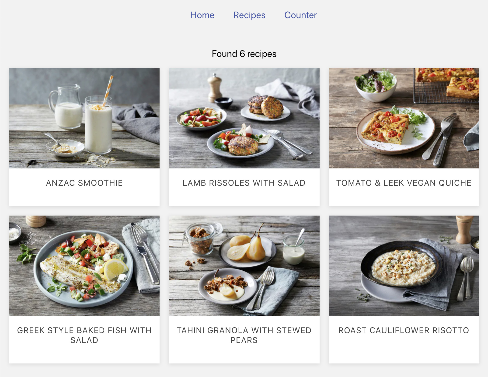

# Recipes App

## Docs

Browser React app written using TypeScript and SCSS.

- **api**: the mock api that fetches recipes
- **components**: pure, presentation only components
- **containers**: components that connect with Redux
- **redux**: the store, and actions and reducers grouped similar to the [ducks style](https://github.com/erikras/ducks-modular-redux)
- **routing**: the history object, and configured routes
- **styling**: shared CSS and variables

In the project directory, you can run:

### Running: `npm start`

Runs the app in development mode. 
Open [http://localhost:3000](http://localhost:3000) to view it in the browser.

### Testing: `npm test`

Launches the test runner in the interactive watch mode. 

- Tests are written and run using **Jest**
- React is tested using [**react-testing-library**]((https://github.com/testing-library/react-testing-library))
  - These tests are focused on the HTML, not the hierarchy of React components. This means components can be refactored and renamed at will, without breaking the tests. They test the behaviour, not the implementation details.
- Redux is tested using [**redux-mock-store**](https://github.com/dmitry-zaets/redux-mock-store)

See the section about [running tests](https://facebook.github.io/create-react-app/docs/running-tests) for more information.

### Building: `npm run build`

Builds the app for production to the `build` folder. 
It correctly bundles React in production mode and optimizes the build for the best performance.

See the section about [deployment](https://facebook.github.io/create-react-app/docs/deployment) for more information.

## What was done

- React app using [Create React App](https://github.com/facebook/create-react-app).
- All code written in TypeScript, which aides in both writing and reading code.
- Added recipes.json fetched with simulated delay, loaded using [babel macros](https://github.com/kentcdodds/babel-plugin-macros)
- Added React Router, with a history object which allows subscribing to changes independently of React.
- Added Routes component which can be unit tested in isolation.
- Added PrimaryNav for navigating between pages.
- Unit tested components using [react-testing-library](https://github.com/testing-library/react-testing-library)
- Added some CSS variables defined in `styling/_variables.scss`
- Added Redux in the "ducks" style of grouping actions and reducers.
- Minimized boilerplate with Redux by exploiting TypeScript types for everything. Incorrect action names or typos will be caught at compile time.
- Added two reducers, one `counter` to discover a pattern with Redux and TypeScript, and another `recipesContent` for loading and storing recipes.
- Added testing of actions and reducers, with a mocked store using `redux-mock-store`.
- Added types for packages without in `deps.d.ts`

## What I’d improve in the future

- Make recipes content actions and reducer reusable for other requests/responses.
- Find out what browsers must be supported, and therefore if features like CSS variables and grid are possible.
- Connect to a real API, or at least write a little dummy API to write against.
- Write end to end tests using puppeteer or cypress.
- Better error handling with helpful error messages.
- Add error boundaries.
- Show or use tags in recipes in some way.
- Improve design of page and cards with custom fonts, polish, etc.
- Link recipes to individual pages.
- Pluralisation handling (1 recipe vs 1 recipes)
- Work out a system for theming.
- Cache data so we don’t have to reload on every navigation.

----

## Other Available Scripts

### `npm run eject`

**Note: this is a one-way operation. Once you `eject`, you can’t go back!**

If you aren’t satisfied with the build tool and configuration choices, you can `eject` at any time. This command will remove the single build dependency from your project.

Instead, it will copy all the configuration files and the transitive dependencies (Webpack, Babel, ESLint, etc) right into your project so you have full control over them. All of the commands except `eject` will still work, but they will point to the copied scripts so you can tweak them. At this point you’re on your own.

You don’t have to ever use `eject`. The curated feature set is suitable for small and middle deployments, and you shouldn’t feel obligated to use this feature. However we understand that this tool wouldn’t be useful if you couldn’t customize it when you are ready for it.

## Learn More

You can learn more in the [Create React App documentation](https://facebook.github.io/create-react-app/docs/getting-started).

To learn React, check out the [React documentation](https://reactjs.org/).
